# nextecom

NextEcom is a full-stack ecommerce application built with Next.js 15 (App Router), NextAuth.js, MongoDB, and Stripe.

> **Demo Credentials**: test@test.com / test1234

> 🔗 [Demo Website](https://nextecom-bay.vercel.app/)

---

## 📌 What It Does

A complete ecommerce experience allowing users to browse, filter, and purchase products, while giving admins control over managing categories, tags, products, orders, and user roles.

---

## ⚙️ Features

### 🛍️ User Features

- Email/password and Google login
- View and filter products by category, tag, and brand
- Product search, reviews, and ratings
- Add to cart, remove, and adjust quantity
- Secure checkout with Stripe integration
- View past orders and order status
- Forgot/reset password via email

### 🛠️ Admin Features

- Admin dashboard with product analytics
- Create, update, delete: categories, tags, and products
- Upload product images with Cloudinary
- Role-based access (admin/user)
- Manage orders and refunds
- Moderate reviews and ratings

### 🧩 Extras

- Pagination for product listings
- Star rating system
- Related product suggestions
- Dark/light mode support (if included)
- Charts using Recharts for dashboard stats

---

## 🧑‍💻 Tech Stack

- **Frontend**: Next.js, Bootstrap / Material CSS
- **Authentication**: NextAuth.js (Email + Google)
- **Backend**: Next.js API Routes
- **Database**: MongoDB (Mongoose)
- **Payments**: Stripe API + Webhooks
- **Media Storage**: Cloudinary
- **Email**: Nodemailer
- **Deployment**: Vercel

---

## 🚀 Getting Started

1. Clone the repo and install dependencies:

   ```bash
   git clone https://github.com/your-username/nextecom.git
   cd nextecom
   npm install
   ```

2. Create a `.env.local` file in the project root and add:

   ```env
   MONGODB_URI=<your_mongodb_connection_string>
   NEXTAUTH_SECRET=<your_nextauth_secret>
   NEXTAUTH_URL=http://localhost:3000
   STRIPE_SECRET_KEY=<your_stripe_secret_key>
   STRIPE_TAX_RATE=<your_stripe_tax_rate_id>
   STRIPE_SHIPPING_RATE=<your_stripe_shipping_rate_id>
   DOMAIN=http://localhost:3000
   CLOUDINARY_URL=<your_cloudinary_url>
   STRIPE_WEBHOOK_SECRET=<from Stripe CLI or Dashboard>
   ```

   # If testing Stripe webhooks locally

   stripe listen --forward-to localhost:3000/api/stripe-webhook

3. Run the development server:

   ```bash
   npm run dev
   ```

4. Build & start for production:
   ```bash
   npm run build
   npm start
   ```

---

## 📷 Screenshots

Login Page
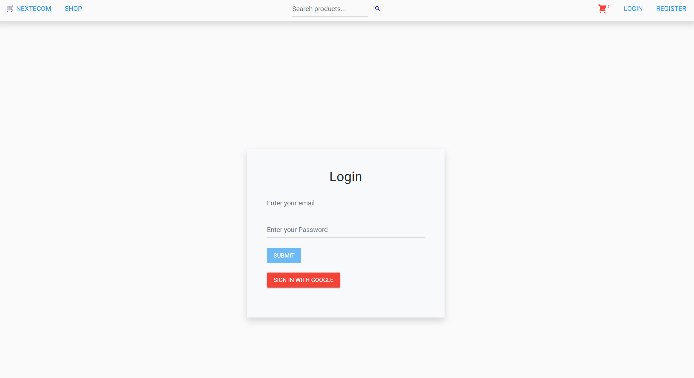

Home Page
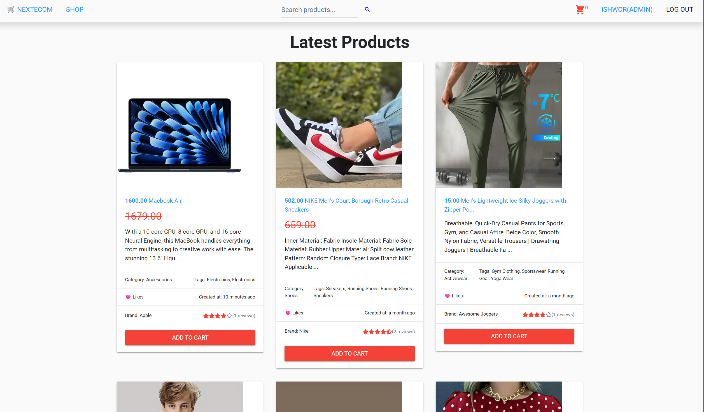

Admin Dashboard
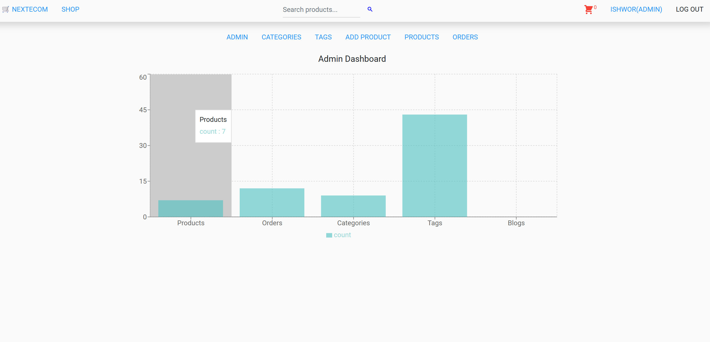

Create Product Page
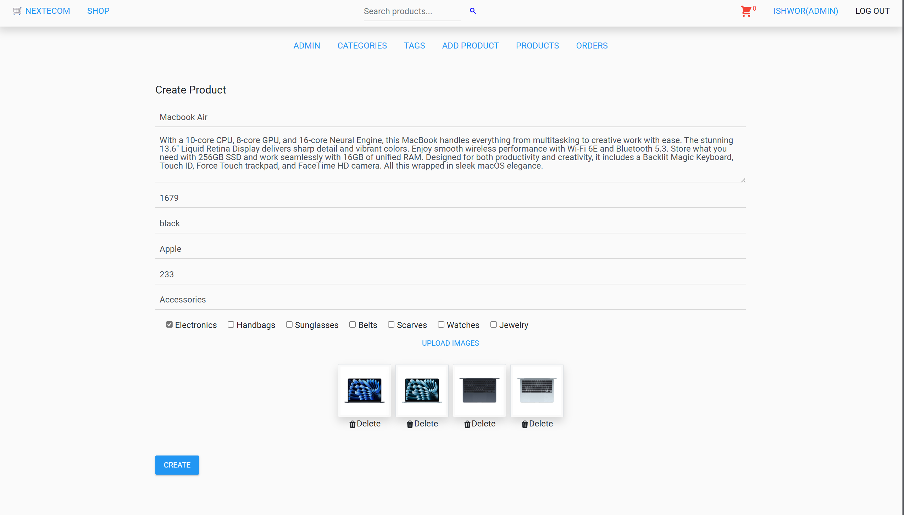

Update Product Page
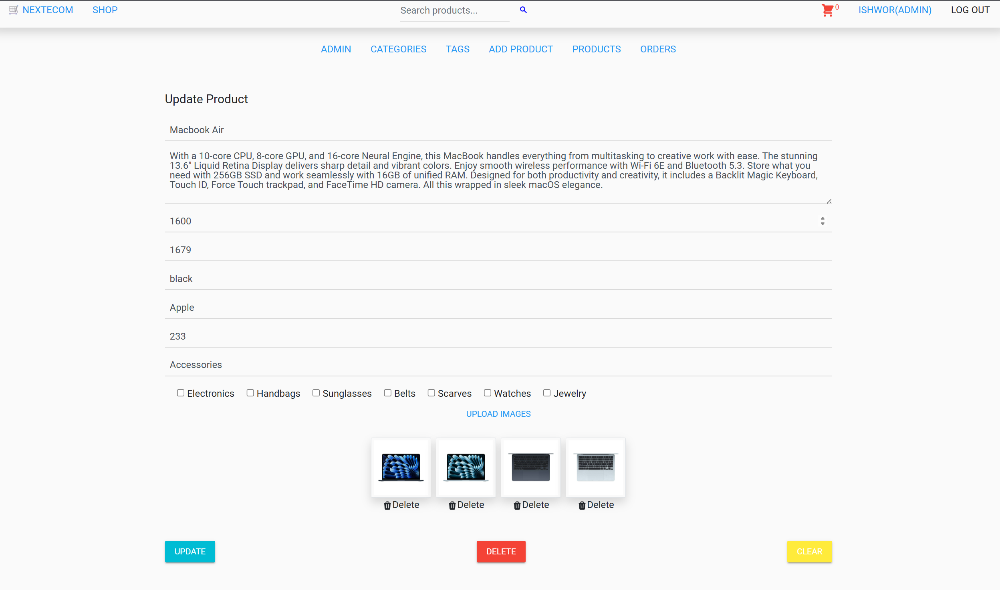

Shop Page
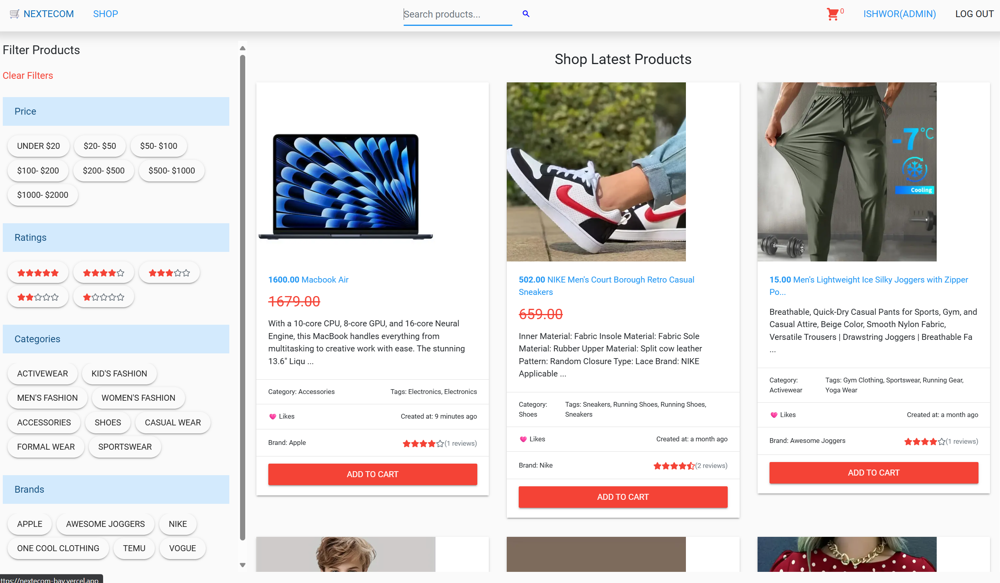

Searching Product
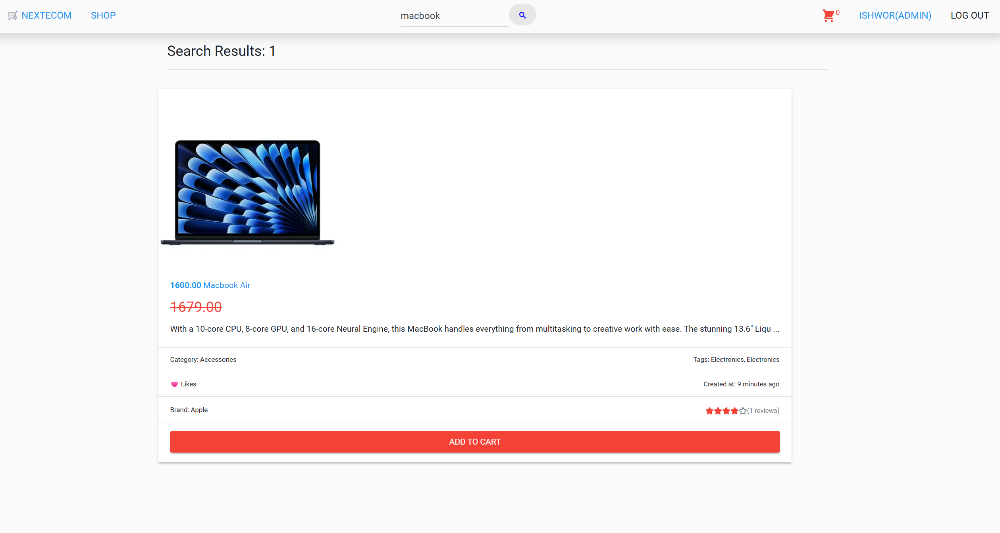

Product Page
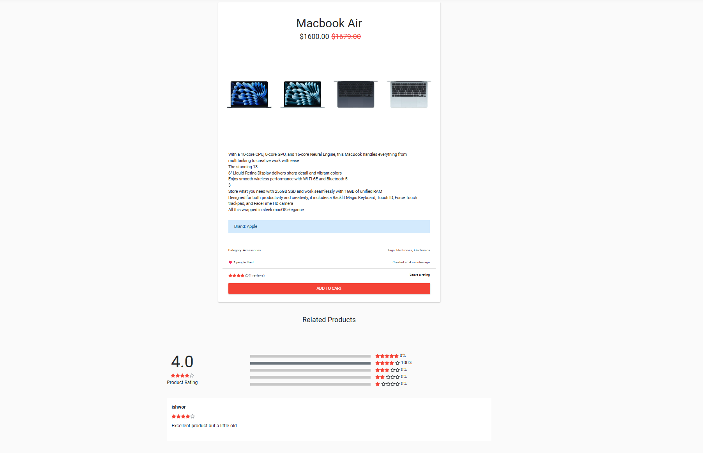

Review Cart
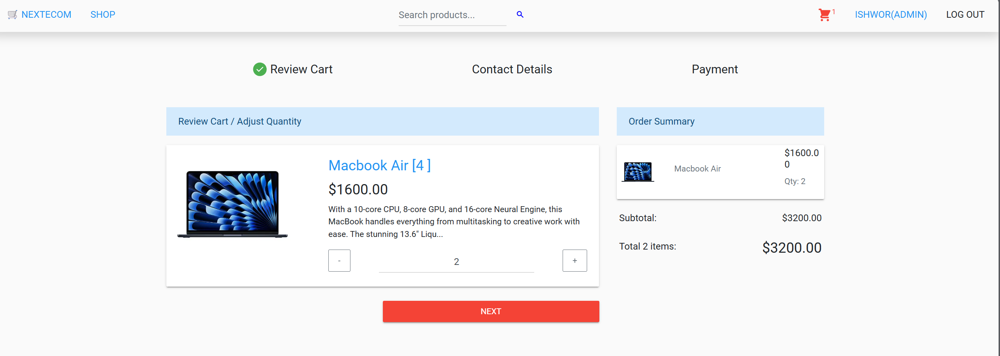

Contact Details
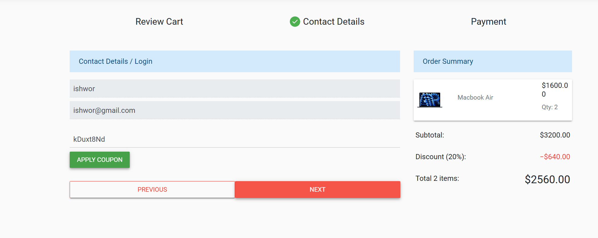

Checkout Page
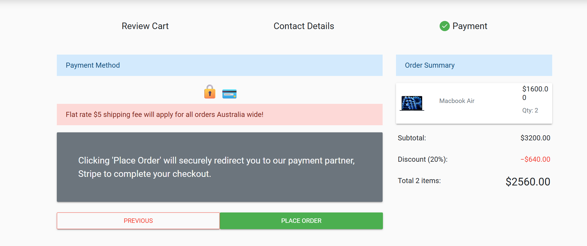

Paying Through Stripe
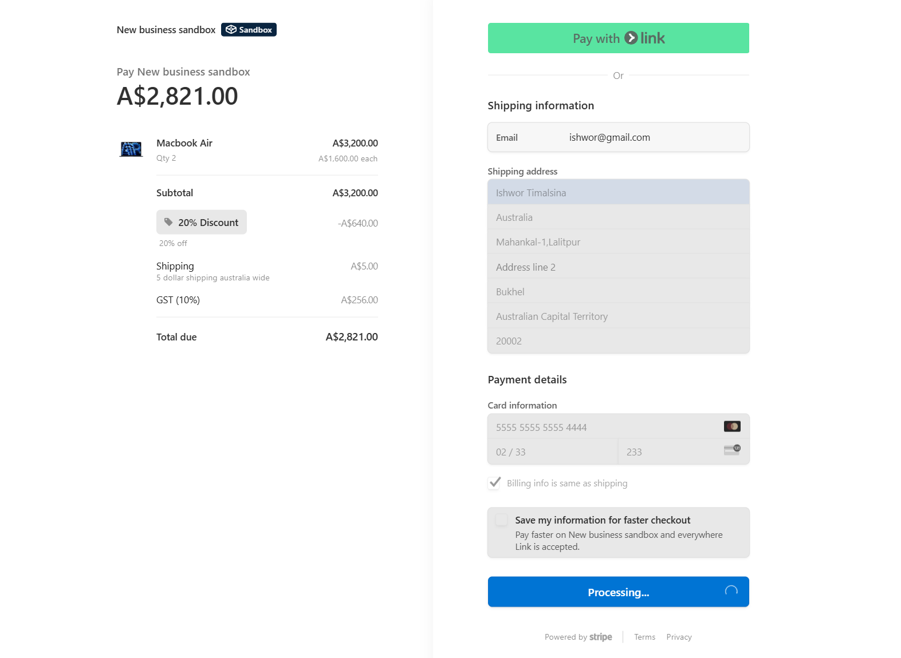

Order Page
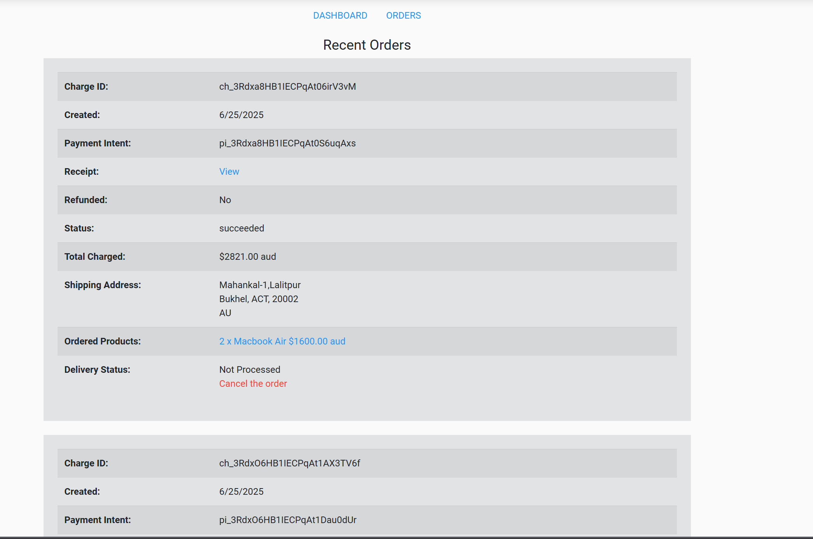

User Orders Page
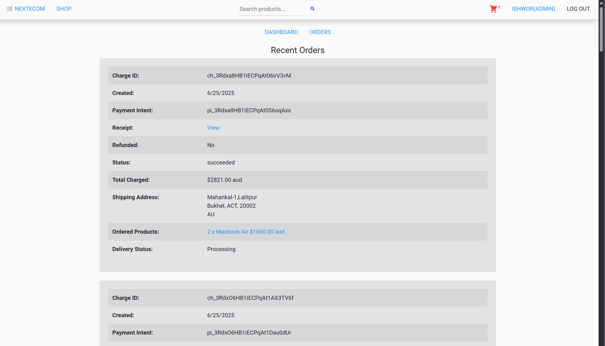

Admin Orders Page
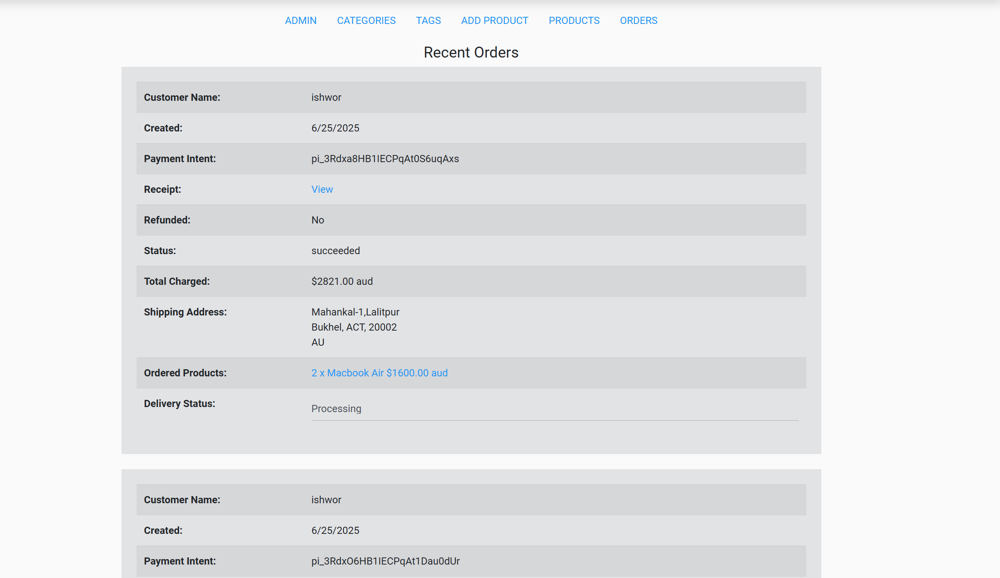

---

## 🧠 Inspiration

This project was built to practice full-stack eCommerce development using modern technologies like Next.js 15, Stripe, and MongoDB. Inspired by real-world marketplaces like Amazon and Flipkart.

---

## 📩 Feedback & Contributions

Feel free to fork this project, open issues, or submit PRs. Feedback is always welcome!

```

```
